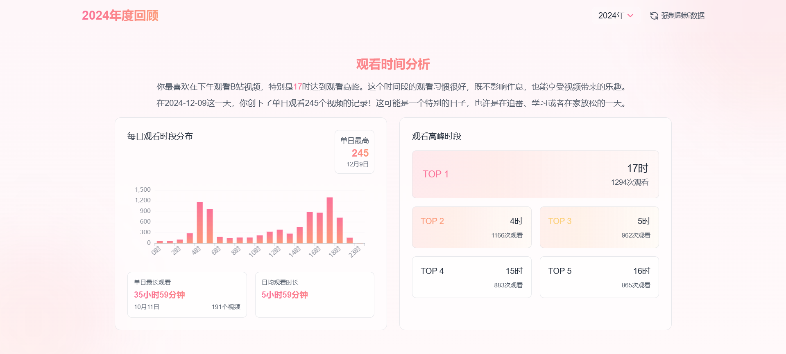

# BilibiliHistoryFrontend

这是一个基于 Vue 3 + Electron 开发的B站历史记录分析工具的前端项目，为用户提供丰富的B站观看历史数据分析功能。

## 该项目需要配合 [BilibiliHistoryFetcher](https://github.com/2977094657/BilibiliHistoryFetcher) 后端项目一起使用

## 首次使用指南

1. **登录账号**
   - 点击侧边栏的设置，然后配置你的服务器地址
   - 然后点击侧边栏中的"未登录"状态
   - 使用B站手机APP扫描二维码进行登录
   - 登录成功后会显示你的用户名

2. **获取历史记录**
   - 登录成功后，点击导航栏中的"实时更新"按钮
   - 首次使用时会自动获取你的全部历史记录，这可能需要一些时间
   - 获取完成后数据会自动导入到本地数据库
   - 页面会自动刷新并显示你的观看历史

3. **后续使用**
   - 每次打开页面时，建议点击"实时更新"以获取最新记录
   - 实时更新只会获取新增的记录，速度很快

## 功能特点

- 🎯 **观看数据总览**：展示用户的观看历史统计数据
- 📊 **多维度分析**：
  - 标题分析：了解最受欢迎的视频标题特征
  - 时长分析：分析不同时长视频的观看偏好
  - 时间分布：展示每日、每周的观看时间分布
  - 标签分析：统计最常观看的视频标签
  - 完成率分析：分析视频观看完成度
- 🎨 **美观的数据可视化**：使用 ECharts 提供丰富的图表展示
- 💻 **跨平台支持**：能使用浏览器的地方就可以显示此页面
- 📥 **视频下载功能**：支持下载B站视频到本地
- 🖼️ **离线图片缓存**：支持缓存视频封面和UP主头像到本地，实现离线查看

## 页面功能介绍

### 1. 主页面（历史记录页）


- **实时更新**：一键同步最新观看记录
- **隐私模式**：模糊化展示视频标题、封面、UP主信息和备注内容
- **日期筛选**：按日期范围筛选历史记录
- **分区筛选**：按视频分区类型筛选
- **搜索功能**：
  - 支持标题搜索
  - 支持UP主搜索
  - 关键词高亮显示

- **视频基本信息展示**:
  - 标题和封面
  - UP主信息
  - 观看时间
  - 观看进度
  - 设备标记（手机、电脑、平板）
  - 视频分类标签
  - 一键跳转原视频
  - 添加和查看备注
  - 备注列表快速查看

### 2. 设置页面


设置页面采用现代化的列表布局设计，提供了直观且易于操作的配置界面：

#### 2.1 基础设置
- **服务器配置**
  - 配置API服务器地址
  - 支持一键重置为默认地址
  - 修改后自动刷新以应用新设置

- **图片源设置**
  - 支持切换在线/本地图片源
  - 本地图片源适合离线环境使用
  - 自动缓存视频封面和UP主头像
  - 无需网络即可查看历史记录中的图片

- **邮件配置**
  - SMTP服务器和端口设置
  - 发件人邮箱配置
  - 收件人邮箱配置
  - 邮箱授权码管理
  - 一键重置邮件配置

#### 2.2 AI摘要配置
- 支持配置AI摘要相关参数
- 自定义摘要生成规则
- 灵活的API设置选项

#### 2.3 数据管理
- **数据导出功能**
  - 支持按年份导出历史记录到Excel
  - 智能获取可用年份列表
  - 导出过程状态实时反馈
  - 自动下载生成的文件

- **数据库下载**
  - 支持下载完整的SQLite数据库文件
  - 包含所有历史记录数据
  - 方便本地备份和高级查询

#### 2.4 危险操作
- **数据库重置**
  - 提供数据库重置功能
  - 自动重新导入原始数据
  - 用于解决数据异常问题
  - 操作前二次确认防止误操作

### 3. 图片管理页面


图片管理页面提供了全面的图片资源管理功能：

#### 3.1 下载管理
- **批量下载选项**：
  - 支持下载全部历史记录的图片
  - 支持按年份下载图片
  - 实时显示下载进度
- **图片类型管理**：
  - 视频封面图片管理
  - UP主头像图片管理
  - 分别显示各类型图片的统计信息

#### 3.2 状态监控
- **实时统计**：
  - 显示总图片数量
  - 已下载数量
  - 下载失败数量
  - 待下载数量
- **详细信息**：
  - 显示实际文件数
  - 显示孤立文件数
  - 最后更新时间
- **失败记录**：
  - 显示下载失败的详细记录
  - 包含失败原因和时间戳
  - 支持查看失败URL

#### 3.3 操作功能
- **一键清空**：支持清空所有已下载的图片
- **状态刷新**：自动刷新显示最新的下载状态
- **进度展示**：使用进度条直观显示下载进度

### 4. 计划任务页面


计划任务页面提供了强大的任务调度和管理功能：

#### 4.1 任务管理
- **主任务管理**：
  - 创建和编辑主任务
  - 设置任务名称
  - 配置调度类型（每日/一次性）
  - 设置执行时间
  - 启用/禁用任务

- **子任务管理**：
  - 为主任务创建子任务
  - 自动设置任务依赖关系
  - 链式任务执行流程
  - 独立的子任务控制

#### 4.2 任务监控
- **执行状态**：
  - 成功率统计和展示
  - 最近执行时间记录
  - 下次执行时间预览

- **详细信息**：
  - 任务执行历史记录
  - 错误日志查看
  - 执行时长统计
  - 成功/失败次数统计

#### 4.3 操作功能
- **任务操作**：
  - 手动触发任务执行
  - 启用/禁用任务
  - 删除任务（含确认机制）
  - 刷新任务状态

- **任务展示**：
  - 树形结构显示
  - 可折叠的子任务列表
  - 清晰的依赖关系展示
  - 直观的状态标识

### 5. 视频下载功能


<div align="center">
  <a href="https://yutto.nyakku.moe/" target="_blank">
    
  </a>
  <p>视频下载功能通过 <a href="https://yutto.nyakku.moe/" target="_blank">Yutto</a> 实现，感谢 Yutto 开发团队的开源贡献。</p>
</div>

#### 5.1 前置要求
- **FFmpeg 安装**：
  - 由于B站视频需要混流合并（将视频流和音频流合并为完整视频），因此需要 FFmpeg 的帮助
  - 支持自动检测 FFmpeg 安装状态
  - 提供详细的多平台安装指南
  - 支持命令行快速复制功能

#### 5.2 基本功能
- **一键下载**：在视频卡片上直接点击下载按钮
- **版本兼容**：
  - 显示当前 FFmpeg 版本
  - 提供兼容性提示
  - 支持关闭封面合成以兼容低版本

#### 5.3 下载管理
- **实时状态**：
  - 显示下载进度
  - 显示当前下载状态
  - 支持查看详细日志
- **错误处理**：
  - 显示详细的错误信息
  - 支持失败后重试
  - 提供故障排查指南

### 6. 年度总结页面（部分页面涉及到隐私就不截图了）

#### 6.1 开场页（HeroPage）


#### 6.2 数据概览（OverviewPage）


#### 6.3 连续观看分析（StreakPage）


#### 6.4 时间分析（TimeAnalysisPage）


#### 6.5 重复观看分析（RewatchPage）


#### 6.6 整体完成率分析（OverallCompletionPage）


#### 6.7 UP主完成率分析（AuthorCompletionPage）


#### 6.8 标签分析（TagsPage）

#### 6.9 时间分布分析（TimeDistributionPage）

#### 6.10 月度趋势分析（MonthlyPage）

#### 6.11 视频时长分析（DurationAnalysisPage）

#### 6.12 标题分析（TitleAnalysisPage）

### 7. 本地摘要功能

本地摘要功能允许用户在本地生成视频内容摘要，无需依赖B站官方AI摘要：

#### 7.1 系统要求
- **硬件要求**：
  - 至少4GB可用内存
  - 足够的磁盘空间用于存储模型和音频文件
  - 推荐使用支持CUDA的NVIDIA显卡（可加速处理）

#### 7.2 主要功能
- **音频转文字**：
  - 支持多种Whisper模型（tiny、base、small、medium、large）
  - 自动下载并管理模型文件
  - 支持中文和英文语音识别
  - 智能语言检测

- **AI摘要生成**：
  - 基于转录文本生成视频内容摘要
  - 支持DeepSeek API和其他AI模型
  - 显示Token使用统计
  - 自动缓存结果，避免重复处理

#### 7.3 使用流程
1. 下载视频音频文件
2. 选择合适的语音识别模型
3. 执行音频转文字操作
4. 生成视频内容摘要
5. 查看带有时间戳的摘要内容

#### 7.4 特色功能
- **时间戳跳转**：点击摘要中的时间戳可直接跳转到B站对应时间点
- **资源监控**：自动检测系统资源是否满足运行要求
- **模型管理**：支持下载、删除和切换不同大小的模型
- **DeepSeek集成**：显示API余额，支持一键刷新

> **注意**：如果系统资源不足，本地摘要功能将无法使用，系统会给出明确提示。

## 技术栈

- **前端框架**：Vue 3
- **构建工具**：Vite
- **桌面端框架**：Electron
- **UI 框架**：
  - Tailwind CSS
  - Vant
  - Headless UI
- **图表库**：ECharts
- **动画效果**：
  - GSAP
  - Lottie
  - Vue Use Motion
- **工具库**：
  - Vue Router
  - Axios
  - Vue Use
  - TypeIt

## 开发环境设置

1. 克隆项目
```bash
git clone https://github.com/2977094657/BiliHistoryFrontend.git
cd BilibiliHistoryFrontend
```

2. 安装依赖
```bash
npm install
```

3. 启动开发服务器
```bash
# 网页版开发
npm run dev

# Electron版本开发
npm run electron:dev
```

4. 构建应用
```bash
# 网页版构建
npm run build

# Electron版本构建
npm run electron:build
```

## 项目结构

```
BilibiliHistoryFrontend/
├── src/                    # 源代码目录
│   ├── api/               # API 接口
│   ├── components/        # Vue 组件
│   │   └── tailwind/     # Tailwind 样式组件
│   ├── router/           # 路由配置
│   └── style.css         # 全局样式
├── electron/              # Electron 相关代码
├── public/               # 静态资源
└── vite.config.js        # Vite 配置
```

## 使用说明

1. 首先需要运行 [BilibiliHistoryFetcher](https://github.com/2977094657/BilibiliHistoryFetcher) 后端服务
2. 启动本前端应用
3. 扫码登录B站账号
4. 开始浏览和分析您的B站观看历史数据

## 贡献指南

欢迎提交 Issue 和 Pull Request 来帮助改进这个项目。

## 许可证

[MIT License](LICENSE)

## 致谢

- [bilibili-API-collect](https://github.com/SocialSisterYi/bilibili-API-collect) - 没有它就没有这个项目
- [Yutto](https://yutto.nyakku.moe/) - 可爱的B站视频下载工具
- [FasterWhisper](https://github.com/SYSTRAN/faster-whisper) - 音频转文字
- [DeepSeek](https://github.com/deepseek-ai/DeepSeek-R1) - DeepSeek AI API
- 所有贡献者

## Star History

[](https://star-history.com/#2977094657/BiliHistoryFrontend&Date)
