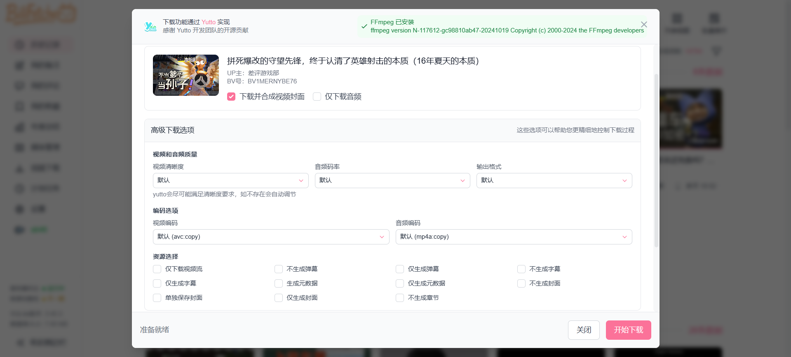

<div align="center">
  
</div>

这是一个基于 Vue 3 开发的 B 站历史记录分析工具的前端项目，为用户提供丰富的 B 站观看历史数据分析功能。

## 该项目需要配合 [BilibiliHistoryFetcher](https://github.com/2977094657/BilibiliHistoryFetcher) 后端项目一起使用

## 快速开始

### 使用 Docker 安装

1. 安装[Docker](https://docs.docker.com/get-started/get-docker/).
2. 构建镜像：`docker build -t bili-history-fetcher-web:dev .`
3. 启动容器：`docker run --name bili-history-fetcher-web -p 5173:80 -d bili-history-fetcher-web:dev`
4. 停止容器：`docker stop bili-history-fetcher-web`

### [通过 1Panel 部署](https://github.com/2977094657/BilibiliHistoryFetcher/discussions/65)
由社区贡献者 [@QYG2297248353](https://github.com/QYG2297248353) 实现 ([#66](https://github.com/2977094657/BilibiliHistoryFetcher/pull/66))
### 使用源码安装

1. 克隆项目
```bash
git clone https://github.com/2977094657/BiliHistoryFrontend.git
cd BilibiliHistoryFrontend
```

2. 安装依赖
```bash
npm install
```

3. 启动开发服务器
```bash
# 网页版开发
npm run dev
```

4. 构建应用
```bash
# 网页版构建
npm run build
```

## 首次使用指南

1. **登录账号**
  - 点击侧边栏的设置，然后配置你的服务器地址
  - 然后点击侧边栏中的"未登录"状态
  - 使用 B 站手机 APP 扫描二维码进行登录
  - 登录成功后会显示你的用户名

2. **获取历史记录**
  - 登录成功后，点击导航栏中的"实时更新"按钮
  - 首次使用时会自动获取你的全部历史记录，这可能需要一些时间
  - 获取完成后数据会自动导入到本地数据库
  - 页面会自动刷新并显示你的观看历史

3. **后续使用**
  - 每次打开页面时，建议点击"实时更新"以获取最新记录
  - 实时更新只会获取新增的记录，速度很快


## 页面介绍

**1. 主页**


**2. 评论**


**3. 我的收藏**


**4. 媒体管理**


**5. 计划任务**


**6. 设置**


**7. 视频下载功能**



**8. 视频观看总时长**


**9. 年度总结页面**

开场页


年度观看数据


观看时间


重复观看


整体完成率


UP 主完成率


标题关键词


月度关键词


**9. 本地摘要功能**

本地摘要功能允许用户在本地生成视频内容摘要，无需依赖 B 站官方 AI 摘要：


## 使用 Tauri 构建桌面应用

本项目使用 [Tauri](https://tauri.app/) 构建跨平台桌面应用，相比 Electron 具有更小的体积和更高的性能。

**环境准备**

1. 安装 Rust 开发环境
  - 按照 [Rust 官方指南](https://www.rust-lang.org/tools/install) 安装 Rust
  - Windows 用户还需安装 [Visual Studio C++ 构建工具](https://visualstudio.microsoft.com/visual-cpp-build-tools/)

2. 安装 Node.js 依赖
   ```bash
   npm install
   ```

**开发与构建**

1. 开发模式
   ```bash
   npm run tauri:dev
   ```
   这将启动一个开发服务器，并自动打开应用窗口，支持热重载。

2. 构建可执行文件
   ```bash
   npm run tauri:build:exe
   ```
   构建完成后，将在项目根目录生成 `BiliBili-History-Frontend.exe` 可执行文件。

3. 清理构建文件
   ```bash
   npm run tauri:clean
   ```
   清理 `src-tauri/target` 目录中的构建产物，释放磁盘空间。

## 贡献指南

欢迎提交 Issue 和 Pull Request 来帮助改进这个项目。


## 致谢

- [bilibili-API-collect](https://github.com/SocialSisterYi/bilibili-API-collect) - 没有它就没有这个项目
- [Yutto](https://yutto.nyakku.moe/) - 可爱的 B 站视频下载工具
- [FasterWhisper](https://github.com/SYSTRAN/faster-whisper) - 音频转文字
- [DeepSeek](https://github.com/deepseek-ai/DeepSeek-R1) - DeepSeek AI API
- [ArtPlayer](https://github.com/zhw2590582/ArtPlayer) - 强大且灵活的 HTML5 视频播放器
- [aicu.cc](https://www.aicu.cc/) - 第三方 B 站用户评论 API
- [方舟像素字体](https://github.com/TakWolf/ark-pixel-font) - 开源的泛中日韩像素字体
- [缝合像素字体](https://github.com/TakWolf/fusion-pixel-font) - 混搭风格的像素字体
- [小黑盒用户 shengyI](https://www.xiaoheihe.cn/app/bbs/link/153880174) - 视频观看总时长功能思路提供者
- 所有贡献者，特别感谢:
  - [@eli-yip](https://github.com/eli-yip) 对 Docker 部署的贡献
  - [@QYG2297248353](https://github.com/QYG2297248353) 对 1Panel 部署的贡献

## Star History

[](https://star-history.com/#2977094657/BiliHistoryFrontend&Date)
